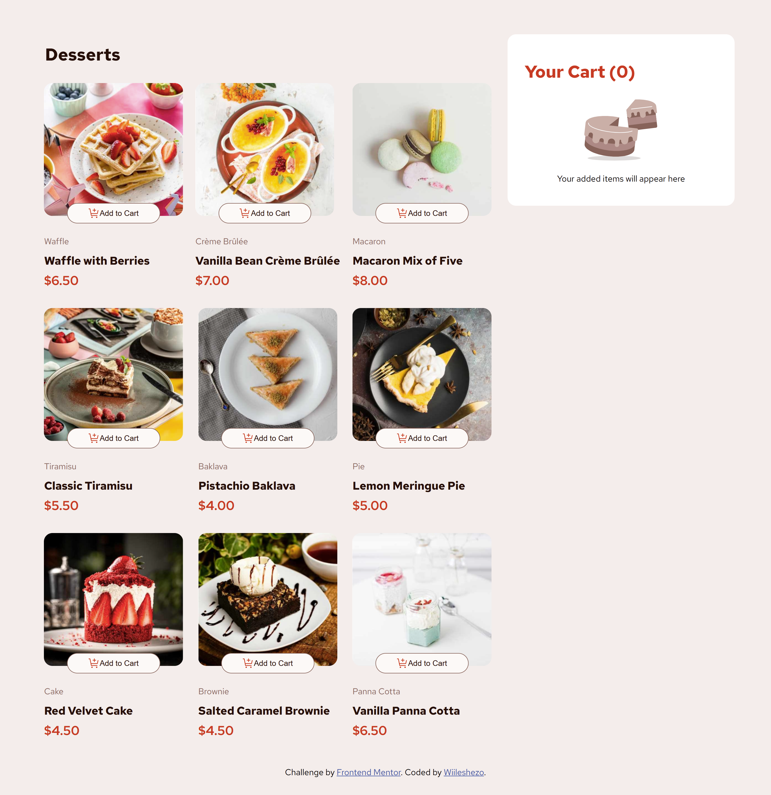

# Frontend Mentor - Product List with Cart Solution

This is a solution to the **Product list with cart** challenge on Frontend Mentor. Frontend Mentor challenges help you improve your front-end coding skills by building real project UIs and interactions. :contentReference[oaicite:0]{index=0}

---

## 📍 Live Demo

See the live project here:  
https://wiileshezo.github.io/product-list-with-cart-main/

---

## 📸 Screenshot



---

## 🧠 Overview

### The challenge

Users should be able to:

- View a list of products
- Add items to the cart
- Increase or decrease item quantities
- Remove items from the cart
- View updated cart totals
- View a responsive layout across screen sizes
- View hover and focus states for interactive elements :contentReference[oaicite:1]{index=1}

---

## 🛠️ Built with

- **Vue 3**
- **Pinia** (state management)
- **HTML5**
- **CSS3**
- **JavaScript (ES6+)**
- **Flexbox & CSS Grid**

---

## 🚀 My Process

### What I did

- Broke UI into reusable Vue components
- Used **Pinia** for global cart state
- Handled operations like add, remove, and update cart items
- Made it responsive and interactive

### What I learned

- Better state management with Pinia
- Vue component communication
- Structuring a real Vue project
- Managing dynamic UI based on reactive data

---

## 🎯 Continued Development

- Improve accessibility (ARIA roles, keyboard navigation)
- Add animations to cart interactions
- Add unit tests for Pinia store logic

---

## ⚙️ Installation & Setup

To run this project locally:

```bash
git clone https://github.com/Wiileshezo/product-list-with-cart-main
cd product-list-with-cart-main
npm install
npm run serve

```
